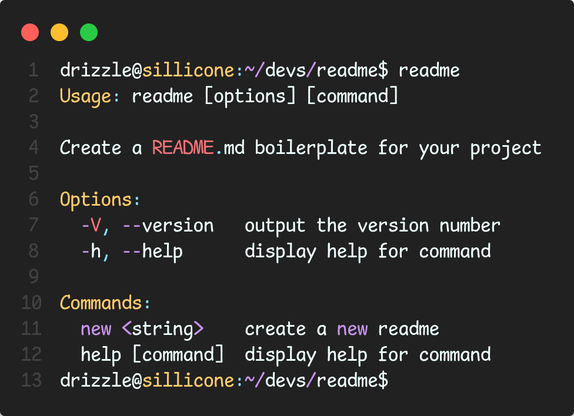

# README

Generate a README boilerplate for your project in 30ms!


- [Description](#description)
- [Getting Started](#getting-started)
- [Prerequisites](#prerequisites)
- [Installation](#installation)
- [Usage](#usage)
- [Support](#support)
- [Documentation](#documentation)
- [License](#license)

## Getting Started

To get started, clone the project and install the [Deno](https://deno.land)

## Prerequisites

The application only require [Deno](https://deno.land) to run locally

Make sure you have it installed and set up before proceeding with the installation and usage of the application.

## Installation

`deno task install` will install your CLI tool in `$HOME/.deno/bin` or a custom directory when you set the DENO_INSTALL_ROOT environment variable.

## Usage

- to run the project locally

```sh
deno task dev
```

- to build the project locally run

```sh
deno task build
```

- to install the binary

```sh
deno install --allow-sys --allow-read --allow-write main.ts
```

## Support

Information on how to get help and support for the project, including contact details for your company's support team.

## Documentation

Information on the software design, API documentation, etc

## License

The project is distributed under [ GNU GENERAL PUBLIC LICENSE](./LICENSE)
